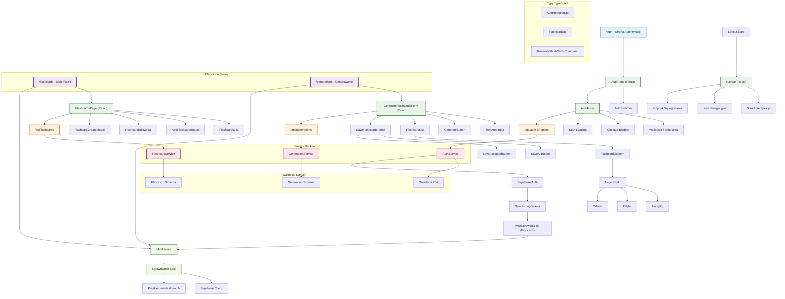

# Diagram architektury UI - Moduł autentykacji i zarządzania fiszkami

Ten diagram przedstawia architekturę komponentów UI dla aplikacji 10x-cards, ze szczególnym uwzględnieniem modułu autentykacji oraz głównych funkcjonalności aplikacji.

## Opis głównych modułów

### Moduł Autentykacji
- **AuthPage**: Główny komponent zarządzający stanem trybu (login/register)
- **AuthSwitcher**: Przełącznik między trybami logowania i rejestracji
- **AuthForm**: Formularz z walidacją, obsługą błędów i komunikacją z API
- **AuthService**: Serwis backendowy obsługujący autentykację z Supabase

### Moduł Fiszek
- **FlashcardsPage**: Zarządzanie listą fiszek użytkownika
- **FlashcardsList**: Wyświetlanie i paginacja fiszek
- **Modals**: Tworzenie i edycja fiszek

### Moduł Generowania
- **GenerateFlashcardsForm**: Główny formularz do generowania fiszek przez AI
- **FlashcardList**: Lista propozycji z możliwością akceptacji/edycji/odrzucenia
- **SaveFlashcardsPanel**: Panel do zapisu wybranych fiszek

### Ochrona Tras
- **Middleware**: Sprawdzanie sesji użytkownika
- **Layout**: Zarządzanie nawigacją i stanem autentykacji
- **Navbar**: Dynamiczna nawigacja zależna od stanu logowania

### Przepływ Danych
1. Użytkownik loguje się przez AuthForm
2. Po sukcesie przekierowanie do chronionych stron
3. Middleware sprawdza sesję dla każdego żądania
4. Komponenty React komunikują się z API endpoints
5. Serwisy backend obsługują logikę biznesową 